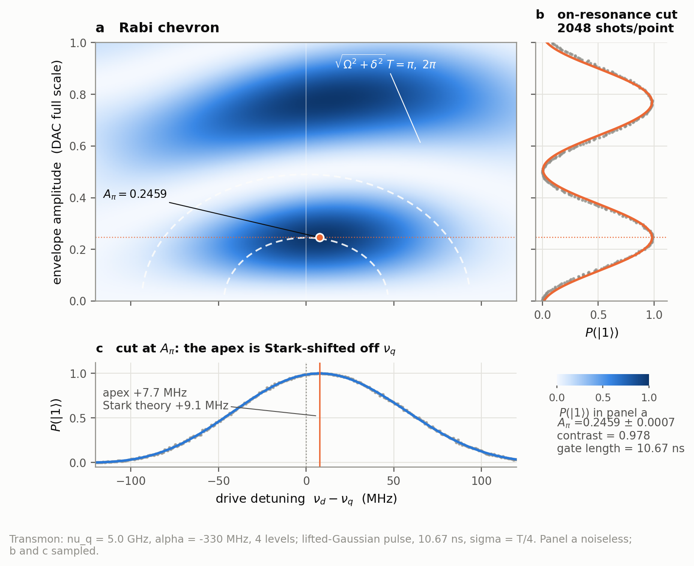
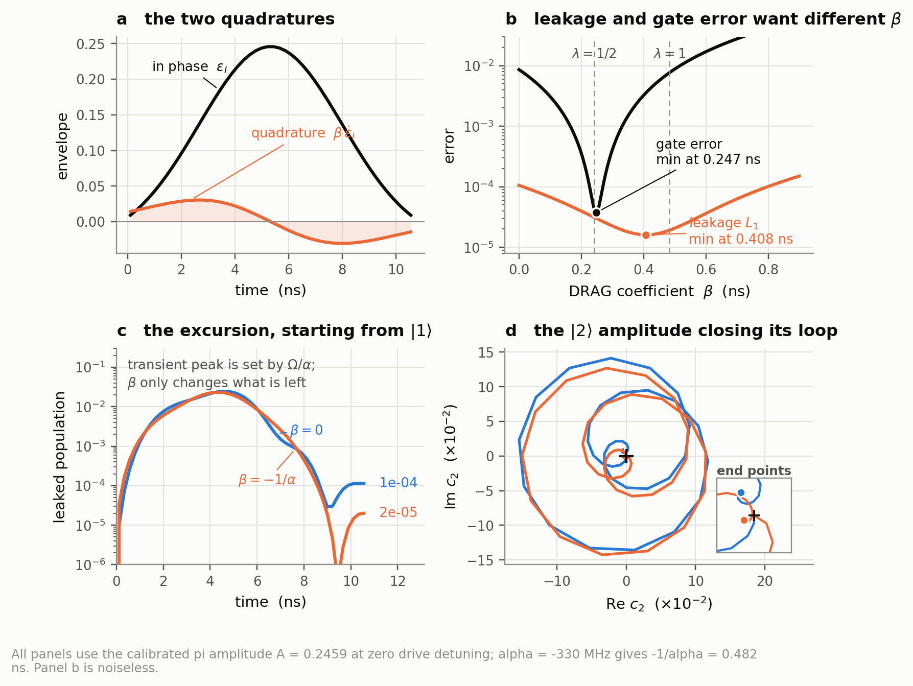
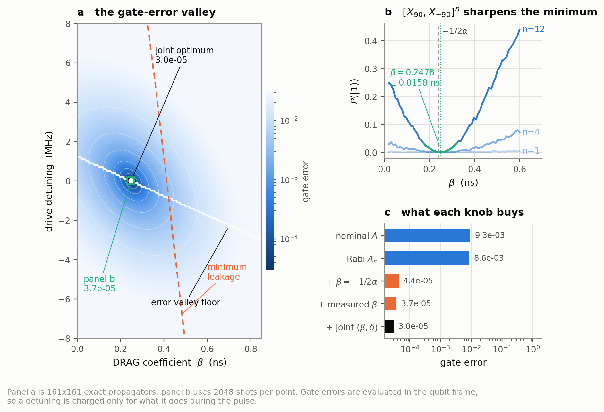
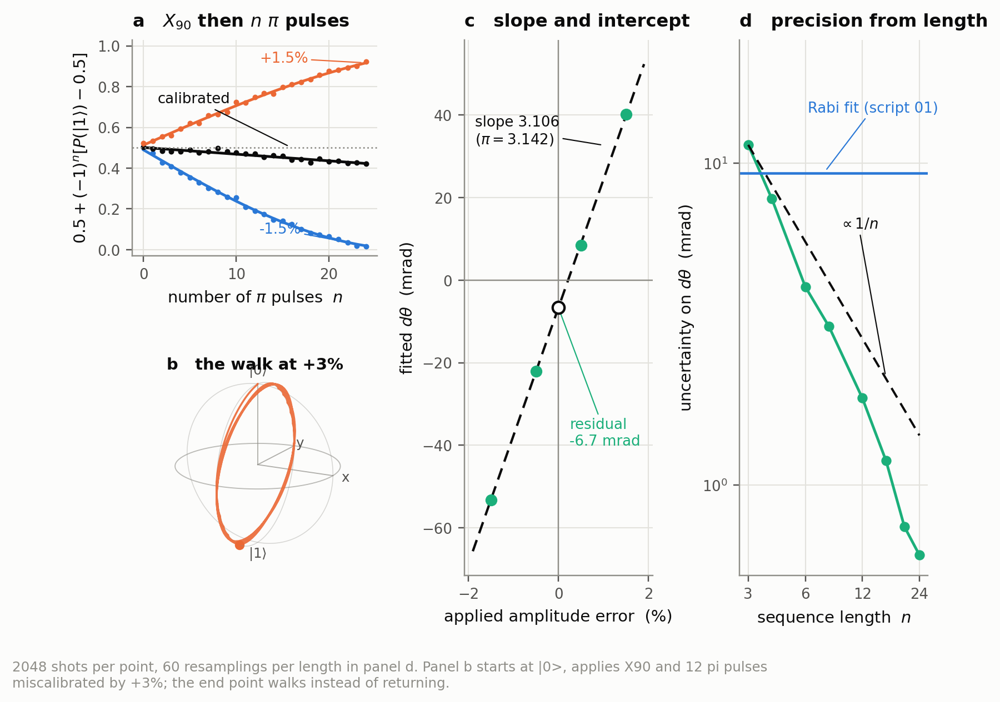
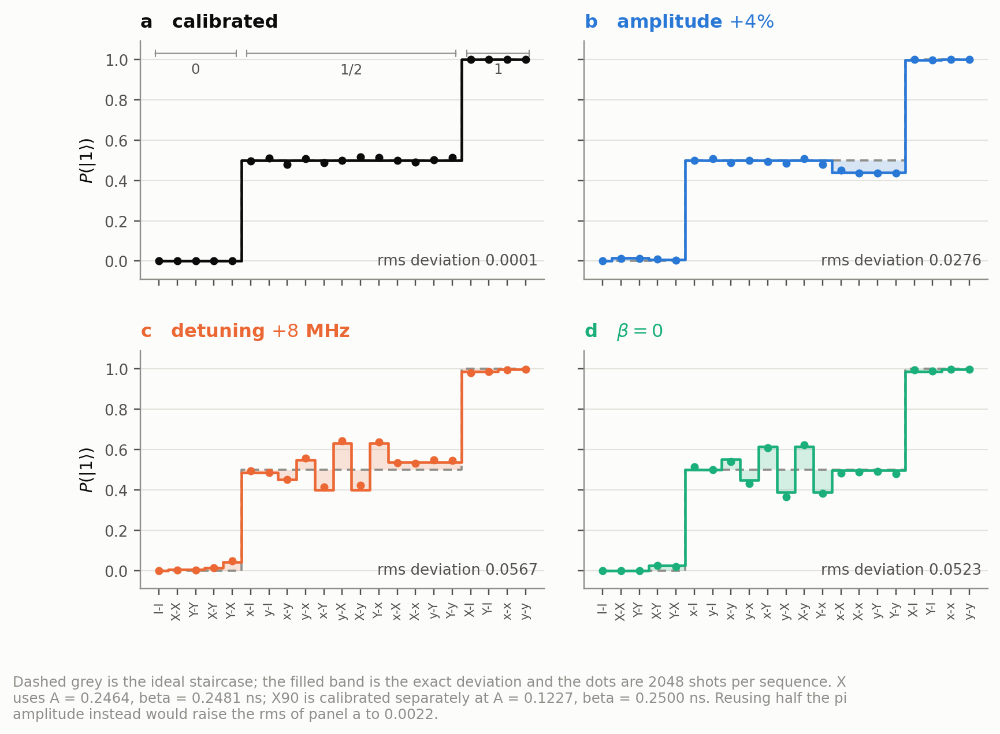
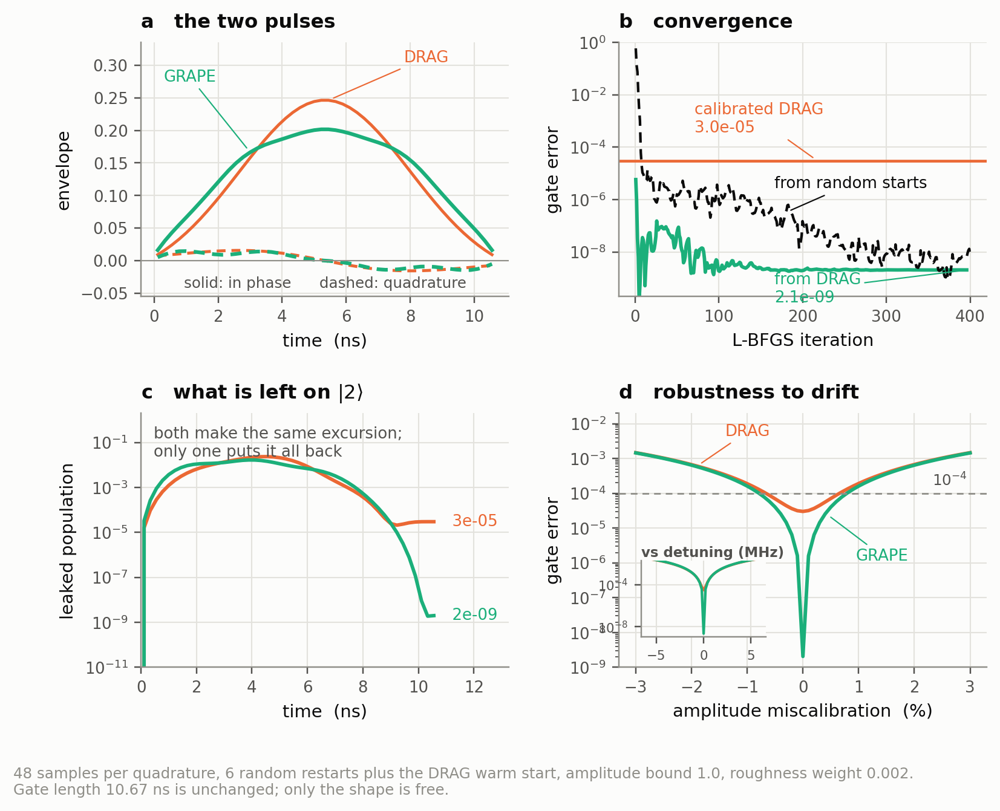
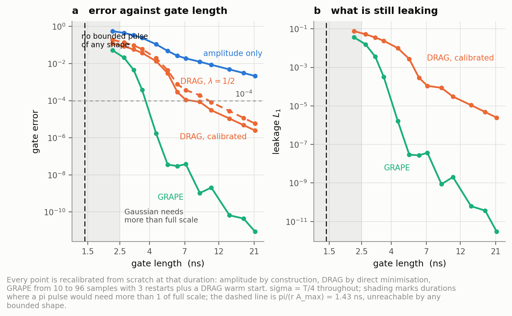

# Pulse-level calibration of a single-qubit gate

Gate-level quantum programming assumes an `X` exists. This repository works one
layer below that assumption: it builds a transmon out of a Duffing oscillator,
shapes a microwave pulse, and then *earns* the gate by running the same
calibration experiments a real control stack runs, in the same order, with shot
noise. It then asks how much better numerical optimal control can do, and where
the wall is.

The system is a weakly anharmonic transmon truncated to four levels, driven on
one line, simulated in the rotating frame. The gate is a `pi` rotation about
`x`. Everything else is measured.

```text
nu_q  = 5.0 GHz        qubit frequency
alpha = -330 MHz       anharmonicity, so |1> -> |2> sits 330 MHz below |0> -> |1>
r     = 350 MHz        Rabi rate at full DAC scale
dt    = 1/4.5 GS/s     AWG sample period
T     = 10.67 ns       gate length (48 samples), sigma = T/4
```

The headline numbers, all reproducible from a clean checkout:

| stage | gate error | what changed |
|---|---|---|
| nominal amplitude guess | `9.3e-3` | nothing calibrated |
| Rabi amplitude sweep | `8.6e-3` | `A_pi` from a sinusoid fit |
| analytic DRAG, `lambda = 1/2` | `4.4e-5` | one line of theory, no tuning |
| measured DRAG coefficient | `3.7e-5` | repeated-sequence `beta` scan |
| fine amplitude by error amplification | `3.0e-5` | residual over-rotation removed |
| GRAPE over both quadratures | `2.1e-9` | ansatz dropped entirely |

The single most useful thing in that table is the third row: an analytic
correction derived in 2009 removes 99.5% of the error before any tuning
happens. The last row is what the ansatz was costing.

Read those as closed-system numbers. There is no decoherence, no line
distortion, and the model's parameters are known exactly, so the bottom row is a
statement about how much the DRAG *ansatz* gives up, not a prediction for a
device -- hardware single-qubit gates sit near `1e-4`, for reasons collected in
[what is deliberately not here](#what-is-deliberately-not-here). The quantity
this repository can speak to is the *ratio* between rows, and the mechanism
behind each drop.

---

## The physics, in the order the code uses it

### A transmon is an oscillator that is almost harmonic

Expanding a Cooper-pair box in the `E_J >> E_C` regime gives an anharmonic
ladder with `alpha ~ -E_C` [1, 2]. Driven on one line and moved into the frame
rotating at the drive frequency, the Hamiltonian is

```text
H(t)/hbar = sum_j [ j*Delta + (alpha/2) j(j-1) ] |j><j| + (r/2)( eps a' + eps* a )
```

with `Delta = w_q - w_d` and `eps = eps_I + i eps_Q` the complex baseband
envelope an IQ mixer produces. In the qubit subspace the drive is
`(r/2)(eps_I sx - eps_Q sy)`: the in-phase quadrature rotates about `x`, the
out-of-phase quadrature about `-y`, and `Delta` tilts the axis.

Two facts fall straight out and are used everywhere.

**The drive strength is not a physical knob.** `r` and `eps` appear only as a
product, so `r` decides how much DAC range a calibrated pulse consumes and
nothing else. Doubling `r` and halving every amplitude gives a bit-identical
propagator, which is asserted in the test suite. That is why the numbers here
are quoted as fractions of full scale.

**How many levels is enough depends on how good the pulse is.** Three is the
minimum truncation that exposes leakage at all, and for the calibrated DRAG
pulse it is already within 0.3% of the converged answer. It is *not* enough for
the optimised pulse: GRAPE reaches `2.1e-9` at four levels and the same waveform
re-simulated with three reports `1.0e-6`, a factor of 500, because a pulse
pushed that far starts to care about `|3>`. Four levels is where the study runs;
`results/validation.json` and `results/grape.json` record both convergence
tables. The general lesson is that a truncation is only justified relative to a
target accuracy.

### The propagator is a product, not an integral

An AWG emits a staircase. The exact propagator of a sampled pulse is therefore
exactly a product of matrix exponentials, one per sample, with no
discretisation error to defend:

```text
U = U_{K-1} ... U_0,   U_k = exp(-i H_k dt)
```

Every `H_k` is Hermitian and 4x4, so one batched `eigh` builds all of them at
once, and the same eigendecomposition supplies *exact* control derivatives for
the optimiser later. This is the whole numerical core, in
[`src/pulsecal/propagate.py`](src/pulsecal/propagate.py).

An independent check matters more than a fast one. Qiskit Dynamics [3] is
handed the *laboratory-frame* Hamiltonian and does the frame transformation,
the rotating-wave approximation and an adaptive ODE solve itself. The two agree
to `1e-9`, which tests the frame algebra and the RWA together rather than just
the arithmetic.

That same comparison prices the RWA. Keeping the counter-rotating terms changes
the propagator by `1.6e-2` -- but changes the *gate error* of the calibrated
pulse from `8.296e-5` to `8.348e-5`, a 0.6% difference. Almost all of the RWA
error is a frame phase that calibration absorbs. Recording both numbers is the
point: the large one looks alarming and does not matter.

---

## Walking the calibration chain

### 1. Amplitude and frequency: the chevron



Sweeping the drive amplitude at fixed pulse length gives a sinusoid in
excitation, and its first maximum defines `A_pi`. Repeating the sweep against
drive frequency turns that trace into the pattern the measurement is named for:
off resonance the Bloch vector precesses about a tilted axis at the generalised
Rabi rate `sqrt(Omega^2 + delta^2)`, so a fixed-length pulse needs more
amplitude for the same excitation and the fringes bow outwards. The dashed
ellipses are the analytic condition `sqrt(theta^2 + (2 pi delta T)^2) = m*pi`
with `theta = r * integral eps_I dt`, and they land on the measured fringes with
no fitting.

The fit gives `A_pi = 0.2459 +/- 0.0007` against a two-level prediction of
`0.2451`. That gap is only 1.1 sigma, so the sampled run alone cannot claim it
is physical. Refitting without shot noise settles it: the four-level model
returns `0.2461` (`+0.42%`), and the same fit on a genuine two-level device
returns the analytic value to six digits. The shift is the higher levels, and
the noisy run happened to land 0.3 sigma below it. Both control fits are in
`results/validation.json`; quoting the sampled number against its own error bar
would have been the wrong way to make the point.

**The apex is not at `nu_q`.** A strong drive Stark-shifts the transition it is
driving, and it is the shifted frequency the chevron finds. The measured
displacement is `+7.7 MHz` against the second-order prediction
`delta = (lambda^2 - 4) Omega^2 / 4 alpha` evaluated at `lambda = 0`, which
gives `+9.1 MHz` [4]. Right sign, right size, and a reminder that a
second-order formula used at `Omega/|alpha| ~ 0.26` is a guide rather than an
answer.

### 2. What DRAG actually does



A resonant drive does not only rotate `|0> <-> |1>`. The same tone is only
`|alpha|` away from `|1> <-> |2>`, so a pulse whose bandwidth is comparable to
`alpha` drives that transition too. Panel c shows the consequence starting from
`|1>`: population makes a 2.5% excursion onto `|2>` and mostly, but not
entirely, comes back. What is left behind is a small residual leakage and a
phase error on the qubit.

DRAG cancels the leading non-adiabatic coupling by adding a control proportional
to the *rate of change* of the envelope, in the orthogonal quadrature so the
rotation angle is untouched [5]:

```text
eps_Q(t) = -lambda * d(eps_I)/dt / alpha,   beta = -lambda/alpha  [ns]
```

Panel d is that cancellation made concrete. Viewed in the frame of the
`|1>-|2>` transition, the `|2>` amplitude of a corrected pulse traces a loop
that closes back on the origin; the uncorrected one misses.

**One `beta` cannot fix both problems.** Panel b is the result worth
remembering:

| quantity minimised | measured `beta` | analytic prediction |
|---|---|---|
| leakage `L1` | `0.408 ns` | `-1/alpha = 0.482 ns` (`lambda = 1`) |
| gate error | `0.248 ns` | `-1/2alpha = 0.241 ns` (`lambda = 1/2`) |

The factor of two between them is the difference between cancelling the leakage
and cancelling the phase the leakage excursion leaves behind [4, 6]. Real
calibrations tune against a gate-error-like signal and therefore land near
`lambda = 1/2`, which is what the literature reports and what this simulation
independently reproduces. The leading-order theory is accurate to 3% for the
quantity it was derived for and off by 15% for the other -- exactly the
asymmetry one should expect.

### 3. Calibrating DRAG, and one thing that is easy to get wrong



After the amplitude, a DRAG pulse still has two free parameters: `beta` and the
drive detuning. They are not independent -- `beta` cancels leakage but shifts
phase, a detuning shifts phase but does nothing about leakage -- so the gate
error sees a *valley* running diagonally across the plane rather than a bowl.
Panel a computes it exactly; the white line is the best detuning at each `beta`
and the dashed orange line is where leakage is minimised. They cross once.

Panel b is the part an experiment can measure cheaply. `[X90, X(-90)]` is the
identity for a correctly corrected pulse, so repeating it `n` times amplifies
the residual error linearly while the readout noise stays put, and the minimum
sharpens from barely visible at `n = 1` to unmistakable at `n = 12`. It returns
`beta = 0.2478 +/- 0.0158 ns`, on top of the `lambda = 1/2` prediction.

**The frame is bookkeeping, not error.** A drive parked off `nu_q` defines a
frame that precesses against the qubit, so its propagator picks up
`exp(-i 2 pi delta j T)` on level `j` for free. Control software removes that by
advancing the phase of later pulses -- which is precisely what a virtual-Z gate
is [7]. Charge the pulse for it instead and the artefacts pile up: the apparent
optimal detuning moves to `-5.6 MHz`, the DRAG coefficient inflates to `1.4 ns`
to cancel a phase that was never physical, and an AllXY run reports a `0.06` rms
deviation that is not there. With the frame handled in both places
(`propagate.gate_propagator` strips it before any fidelity comparison,
`sequences.envelope` advances the carrier phase between pulses) the valley is a
few MHz wide, its floor passes through zero detuning, and `beta` does the work.

This was not a design decision made up front. It was found by noticing that a
"better" calibrated `X90` made the AllXY staircase worse, and tracked down from
there.

### 4. Fine amplitude: length beats shots



The Rabi fit locates `A_pi` to 0.3%, which is a `9.3 mrad` rotation error. A
pure over-rotation `dtheta` costs `dtheta^2 / 6` in gate error, so that alone is
`1.4e-5` -- the same order as everything else the pulse still has left, which
makes it worth removing rather than tolerating. More shots is the wrong fix:
the sinusoid's curvature near its maximum is what limits the fit, and that does
not improve. A longer sequence does. Prepare on the equator with an `X90` and
apply the pi pulse `n` times: every rotation shares the `x` axis, so the angles
add to `pi/2 + n(pi + dtheta)` and a per-gate over-rotation enters multiplied by
`n` while projection noise does not [8, 9].

The fitted over-rotation against applied amplitude error has slope `3.106`
where `pi = 3.142` -- a consistency check the experiment passes -- and an
intercept of `-6.7 mrad`. That intercept is the miscalibration the Rabi fit left
behind, comfortably inside its own `9.3 mrad` uncertainty. Dividing it out moves
`A_pi` from `0.245917` to `0.246439` and the gate error from `3.7e-5` to
`3.0e-5`.

Panel d is the scaling law: `1/n`, from the Rabi fit's `9.3 mrad` down to
`0.61 mrad` at `n = 24`, a factor of 15. Panel b shows why it works -- an over-rotated
pulse overshoots the pole a little every time and the trajectory precesses
instead of returning.

### 5. AllXY: what kind of error is it?



Twenty-one two-gate sequences, ordered so an ideal qubit returns `0` for the
first five, `1/2` for the next twelve and `1` for the last four [10, 2]. The
value is not the number but the *shape* of the deviation: an amplitude error
tilts the middle plateau, a detuning breaks it into a zig-zag, and a wrong
`beta` splits the pairs that mix the two axes. Each of the three miscalibrated
panels is recognisable at a glance, which is the entire point of the diagnostic.

**`X90` is not half of `X`.** The rotation angle is not exactly linear in
amplitude, so halving `A_pi` gives a `pi/2` pulse with `1.3e-5` error against
`6.2e-6` for one calibrated in its own right -- only a factor of two, but AllXY
punishes it far harder than that, because the entries containing *two* `pi/2`
pulses compound the error coherently. The rms deviation of panel a is `0.00013`
with separate calibrations and `0.0022` when the amplitude is merely halved, a
factor of 17. Backends store `x` and `sx` as independent calibrations for
exactly this reason, and [`sequences.gate`](src/pulsecal/sequences.py) takes an
optional independently calibrated half pulse so the two can be compared.

One caveat on those rms numbers: they are computed from the exact populations,
not the dots. At 2048 shots each point carries a projection noise of
`sqrt(p(1-p)/N) ~ 0.011`, eighty times the `0.00013` of panel a, so a real run
of the calibrated case is indistinguishable from a perfect staircase. The
quoted rms measures how far the *gate* is off; what an experiment can resolve is
set by the shot count. That is the honest limit of the diagnostic: AllXY is
coarse triage that identifies the error *type* in one shot-cheap pass, and
anything finer belongs to error amplification and randomized benchmarking [9].

### 6. Dropping the ansatz: GRAPE



DRAG is a one-parameter guess at the right pulse. GRAPE treats both quadratures
as `2K` free numbers and ascends the gate fidelity of the leaky system directly
[11]. Two implementation choices decide whether it converges or crawls:
derivatives `dU_k/du` taken *exactly* in the instantaneous eigenbasis rather
than to first order in `dt` [12], and L-BFGS-B rather than fixed-step ascent
[13]. A discrete-Laplacian roughness penalty evaluated with virtual zeros
outside the pulse does two jobs at once -- band-limiting the waveform and
pulling its ends to zero -- so no separate boundary constraint is needed [14].

Given the calibrated DRAG pulse as one starting point among several, the
optimiser reaches `2.1e-9` against DRAG's `3.0e-5`: a factor of 14,700, at the
same gate length, with a peak amplitude of `0.20` of full scale. Starting only
from smooth random seeds it reaches `7.8e-9`, so the warm start helps but is not
doing the work.

Panel c says where the gain comes from. The transient excursion onto `|2>` is
just as large for both pulses -- that is set by `Omega/alpha` and no pulse of
this length avoids it -- but GRAPE returns essentially all of it. Since the
calibrated DRAG pulse's remaining error is *entirely* leakage (`3.028e-5` error,
`3.021e-5` leakage), removing the leakage removes the error.

Two things are checked rather than claimed. A gate error of `1e-9` is only
meaningful if the model is converged there, so the optimised pulse is
re-simulated on deeper ladders: `2.06e-9` at four levels, `2.27e-9` at five and
six, `1.0e-6` at three. And an optimiser told only to maximise fidelity has no
reason to stay tolerant of drift, so panel d measures it -- the GRAPE pulse
stays under `1e-4` out to `0.79%` amplitude error against DRAG's `0.65%`. It is
narrower at its minimum but no more fragile in the range that matters, which is
worth knowing because the opposite is often assumed.

### 7. How short can the gate be?



Every point is recalibrated from scratch at that duration. The gap between
"amplitude only" and "DRAG, calibrated" is what an ansatz plus a calibration
chain buys -- three orders of magnitude at `10 ns`. The gap between that and
GRAPE is what the ansatz was costing.

The interesting part is on the left, where two limits close in and they are not
the same limit. A Gaussian of peak amplitude `A_max` runs out of pulse area at
`2.51 ns`; that ends the *ansatz*, not the gate. A rectangle carries the most
area any bounded pulse can, so `pi / (r A_max) = 1.43 ns` is where an `X` gate
becomes impossible for any shape at all. The factor of 1.75 between them is room
only a non-Gaussian pulse can use, and it is the honest version of a speed limit
for this model: set by the amplitude bound, not by the anharmonicity.

---

## Layout

```text
configs/transmon.yaml     every parameter, with the reasoning for each
src/pulsecal/
  device.py               Duffing transmon, RWA Hamiltonian, analytic predictions
  pulses.py               lifted-Gaussian and DRAG envelopes, qiskit.pulse export
  propagate.py            piecewise-constant propagators, exact control derivatives
  metrics.py              leakage-aware average gate fidelity, Bloch coordinates
  sequences.py            gate sequences as concatenated envelopes, AllXY table
  experiments.py          amplitude, chevron, DRAG, error-amplification routines
  grape.py                gradient ascent pulse engineering
  dynamics.py             independent Qiskit Dynamics cross-check
  plotting.py             shared figure style
  utils.py                config, deterministic seeding, result serialisation
scripts/00_validate.py    solver agreement, RWA cost, truncation, gradients
scripts/01..07            one script per figure, in dependency order
scripts/run_all.py        the whole study
tests/                    23 checks on the parts a figure would not reveal
docs/theory.md            the derivations
docs/references.bib       every work cited, with DOIs
results/*.json            every number quoted above
figures/*.png             every figure above
```

Scripts pass state through `results/*.json`: `01` fixes the pi amplitude, `03`
the DRAG coefficient, `04` the fine amplitude, and `05` and `06` consume all
three. `07` recalibrates from scratch at every duration and depends on none of
them. All randomness derives from one master seed in the config via
`SeedSequence`, so any single figure regenerates in isolation and comes out
identical on the same machine. The sampled experiments are reproducible
anywhere; the GRAPE figures depend on L-BFGS-B's iterate path and can differ in
the last digits across BLAS builds, without moving any conclusion.

## Reproducing

```bash
pip install -r requirements.txt          # or: pip install -e .
python -m pytest tests -q                # 23 passed
cd scripts && python run_all.py          # ~2.5 min, writes results/ and figures/
```

Individual figures, once the scripts they depend on have run at least once:

```bash
cd scripts && python 06_grape.py
```

The scripts add `src` to the path themselves, so an editable install is
optional. `qiskit-dynamics` is needed only by `00_validate.py` and one test.

## What is deliberately not here

The point of drawing the boundary explicitly is that every number above should
be read inside it.

- **No decoherence.** The simulation is unitary, so shorter gates always win in
  figure 7. On hardware the `T1`/`T2` penalty for a long gate competes with the
  leakage penalty for a short one, and that trade-off is what actually picks the
  operating point.
- **No transfer function.** The AWG is assumed ideal. Real lines distort pulses,
  and closing the loop on hardware rather than on a model is the standard
  answer [15, 9].
- **No parameter uncertainty.** `alpha` and `r` are known exactly here. They are
  not on a device, and a pulse optimised against a slightly wrong model loses
  much of its advantage -- the reason robustness is measured in figure 6 rather
  than assumed.
- **Ideal three-state readout.** Shot noise is modelled; assignment error is
  not.
- **One qubit.** No cross-talk, no spectator shifts, no two-qubit gates.

## References

1. J. Koch, T. M. Yu, J. Gambetta, A. A. Houck, D. I. Schuster, J. Majer,
   A. Blais, M. H. Devoret, S. M. Girvin, R. J. Schoelkopf,
   *Charge-insensitive qubit design derived from the Cooper pair box*,
   Phys. Rev. A **76**, 042319 (2007).
2. P. Krantz, M. Kjaergaard, F. Yan, T. P. Orlando, S. Gustavsson, W. D. Oliver,
   *A quantum engineer's guide to superconducting qubits*,
   Appl. Phys. Rev. **6**, 021318 (2019).
3. D. Puzzuoli, C. J. Wood, D. J. Egger, B. Rosand, K. Ueda,
   *Qiskit Dynamics: A Python package for simulating the time dynamics of
   quantum systems*, J. Open Source Softw. **8**, 5853 (2023).
4. J. M. Gambetta, F. Motzoi, S. T. Merkel, F. K. Wilhelm,
   *Analytic control methods for high-fidelity unitary operations in a weakly
   nonlinear oscillator*, Phys. Rev. A **83**, 012308 (2011).
5. F. Motzoi, J. M. Gambetta, P. Rebentrost, F. K. Wilhelm,
   *Simple pulses for elimination of leakage in weakly nonlinear qubits*,
   Phys. Rev. Lett. **103**, 110501 (2009).
6. E. Lucero, J. Kelly, R. C. Bialczak, M. Lenander, M. Mariantoni, M. Neeley,
   A. D. O'Connell, D. Sank, H. Wang, M. Weides, J. Wenner, T. Yamamoto,
   A. N. Cleland, J. M. Martinis, *Reduced phase error through optimized control
   of a superconducting qubit*, Phys. Rev. A **82**, 042339 (2010).
7. D. C. McKay, C. J. Wood, S. Sheldon, J. M. Chow, J. M. Gambetta,
   *Efficient Z gates for quantum computing*, Phys. Rev. A **96**, 022330 (2017).
8. S. Sheldon, L. S. Bishop, E. Magesan, S. Filipp, J. M. Chow, J. M. Gambetta,
   *Characterizing errors on qubit operations via iterative randomized
   benchmarking*, Phys. Rev. A **93**, 012301 (2016).
9. J. Kelly *et al.*, *Optimal quantum control using randomized benchmarking*,
   Phys. Rev. Lett. **112**, 240504 (2014).
10. M. D. Reed, *Entanglement and quantum error correction with superconducting
    qubits*, PhD thesis, Yale University (2013), appendix A.
11. N. Khaneja, T. Reiss, C. Kehlet, T. Schulte-Herbrüggen, S. J. Glaser,
    *Optimal control of coupled spin dynamics: design of NMR pulse sequences by
    gradient ascent algorithms*, J. Magn. Reson. **172**, 296 (2005).
12. S. Machnes, U. Sander, S. J. Glaser, P. de Fouquières, A. Gruslys,
    S. Schirmer, T. Schulte-Herbrüggen, *Comparing, optimizing, and benchmarking
    quantum-control algorithms in a unifying programming framework*,
    Phys. Rev. A **84**, 022305 (2011).
13. P. de Fouquières, S. G. Schirmer, S. J. Glaser, I. Kuprov,
    *Second order gradient ascent pulse engineering*,
    J. Magn. Reson. **212**, 412 (2011).
14. M. Werninghaus, D. J. Egger, F. Roy, S. Machnes, F. K. Wilhelm, S. Filipp,
    *Leakage reduction in fast superconducting qubit gates via optimal control*,
    npj Quantum Inf. **7**, 14 (2021).
15. D. J. Egger, F. K. Wilhelm, *Adaptive hybrid optimal quantum control for
    imprecisely characterized systems*, Phys. Rev. Lett. **112**, 240503 (2014).

Also drawn on, and cited in the source where used:

16. Z. Chen *et al.*, *Measuring and suppressing quantum state leakage in a
    superconducting qubit*, Phys. Rev. Lett. **116**, 020501 (2016).
17. C. J. Wood, J. M. Gambetta, *Quantification and characterization of leakage
    errors*, Phys. Rev. A **97**, 032306 (2018).
18. M. A. Nielsen, *A simple formula for the average gate fidelity of a quantum
    dynamical operation*, Phys. Lett. A **303**, 249 (2002).
19. T. Alexander, N. Kanazawa, D. J. Egger, L. Capelluto, C. J. Wood,
    A. Javadi-Abhari, D. C. McKay, *Qiskit Pulse: programming quantum computers
    through the cloud with pulses*, Quantum Sci. Technol. **5**, 044006 (2020).
20. N. Kanazawa, D. J. Egger, Y. Ben-Haim, H. Zhang, W. E. Shanks,
    G. Aleksandrowicz, C. J. Wood, *Qiskit Experiments: A Python package to
    characterize and calibrate quantum computers*,
    J. Open Source Softw. **8**, 5329 (2023).
21. J. M. Chow, L. DiCarlo, J. M. Gambetta, F. Motzoi, L. Frunzio, S. M. Girvin,
    R. J. Schoelkopf, *Optimized driving of superconducting artificial atoms for
    improved single-qubit gates*, Phys. Rev. A **82**, 040305(R) (2010).
22. A. Blais, A. L. Grimsmo, S. M. Girvin, A. Wallraff, *Circuit quantum
    electrodynamics*, Rev. Mod. Phys. **93**, 025005 (2021).
23. L. S. Theis, F. Motzoi, F. K. Wilhelm, *Simultaneous gates in
    frequency-crowded multilevel systems using fast, robust, analytic control
    shapes*, Phys. Rev. A **93**, 012324 (2016).

BibTeX for all of the above is in [`docs/references.bib`](docs/references.bib).

## License

MIT, see [LICENSE](LICENSE).
